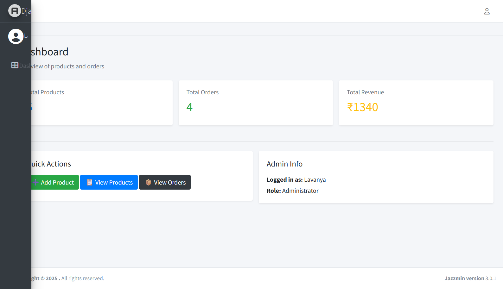
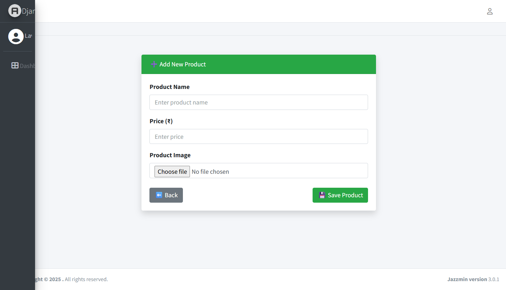
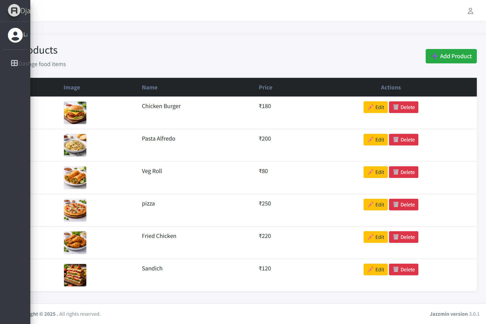
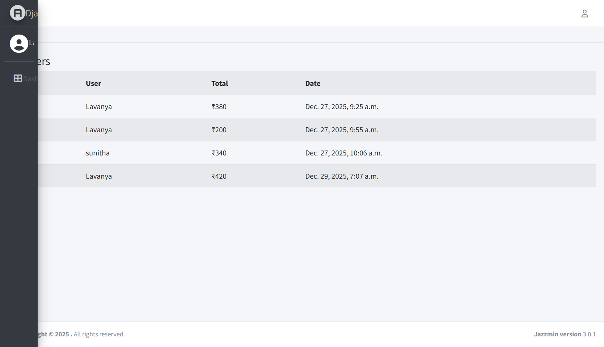

🍔 Online Food Ordering System (Django)

A full-stack Online Food Ordering System developed using Django, Bootstrap, CSS, and JavaScript.
The application allows users to browse food items, manage cart, place orders, and provides a separate Admin Dashboard to manage products and orders.

🚀 Features
👤 User Features

User Registration & Login

View Food Menu with images and prices

Add / Remove items from cart

Update item quantity

Checkout with address and phone number

Place orders

View order history

🛠️ Admin Features (Separate Dashboard)

Secure Admin Login

Add / Edit / Delete food products

Upload food images

View all customer orders

Manage orders from dashboard

🎨 UI & Technology

Responsive UI using Bootstrap

Custom styling with CSS

Dynamic cart functionality using JavaScript

Media handling for food images using Django

🧑‍💻 Tech Stack
Layer	Technology
Backend	Django (Python)
Frontend	HTML, CSS, Bootstrap, JavaScript
Database	MySQL / SQLite
Authentication	Django Authentication
Media Storage	Django Media Files
📂 Project File Structure
food_project/
│
├── food_ordering/          # Project settings
│   ├── settings.py
│   ├── urls.py
│   ├── asgi.py
│   └── wsgi.py
│
├── store/                  # Main application
│   ├── migrations/
│   ├── static/
│   │   ├── css/
│   │   │   └── style.css
│   │   └── images/
│   │       └── hero-food.jpg
│   │
│   ├── templates/
│   │   ├── base.html
│   │   ├── home.html
│   │   ├── menu.html
│   │   ├── cart.html
│   │   ├── checkout.html
│   │   ├── orders.html
│   │   ├── login.html
│   │   └── register.html
│   │
│   │   └── admin/
│   │       ├── dashboard.html
│   │       ├── products.html
│   │       ├── add_product.html
│   │       ├── edit_product.html
│   │       └── orders.html
│   │
│   ├── models.py
│   ├── views.py
│   ├── urls.py
│   └── admin.py
│
├── media/
│   └── foods/
│       ├── burger.jpg
│       ├── pasta.jpg
│       ├── pizza.jpg
│       └── sandwich.jpg
│
├── manage.py
└── requirements.txt

🗂️ Main Modules Explained
🔐 Authentication

Uses Django’s built-in authentication system

Login & Registration pages styled with Bootstrap

Session-based user handling

🛒 Cart System

Add food items to cart

Update quantity or remove items

Automatic total price calculation

📦 Order Management

Orders stored in database

Order items linked to food products

Users can view their order history

🧑‍💼 Separate Admin Dashboard

Custom admin dashboard (not Django default admin)

Manage food items and orders

Easy-to-use UI for administration


## 🏠 User Home Page

This is the main landing page where users can view food items and start ordering.

🔗 **User Home Page URL:**  
http://127.0.0.1:8000/


## 🏠 Home Page


## 🍔 Menu Page


## 🔐 Login Page


## 📝 Register Page


## 🛒 Cart Page


## 💳 Checkout Page


## 📦 Orders Page


## 🧑‍💼 Admin Dashboard

Admin can manage food items, orders, and users using a custom dashboard.

🔗 **Admin Dashboard URL:**  
http://127.0.0.1:8000/admin-dashboard/

## 🧑‍💼 Admin Dashboard


## ➕ Add Product


## 📦 Admin Products


## 📋 Admin Orders


## 🔐 Django Admin Panel

Admin users can manage foods, orders, users, and permissions using Django’s built-in admin interface.

🔗 **Admin URL:**  
http://127.0.0.1:8000/admin/

### Dashboard Overview


### Admin Login Page


### Users Management


### Food Management


### Orders Management


### Order Items


## ▶️ How to Run the Project

```bash
pip install -r requirements.txt
python manage.py migrate
python manage.py runserver


